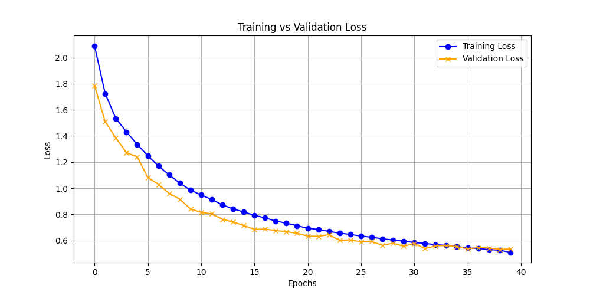
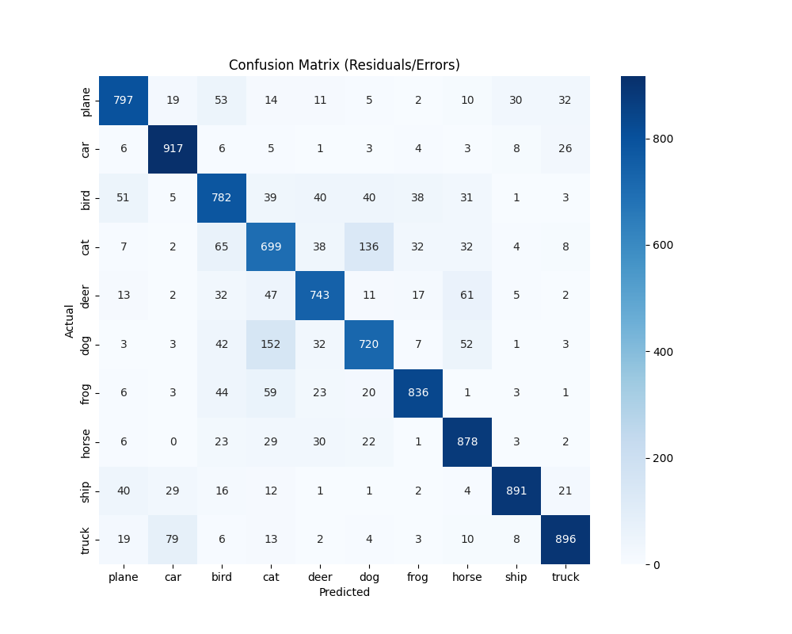

# End-to-End Image Classification (CIFAR-10)

A full-stack Machine Learning application that trains a CNN from scratch and serves predictions via a REST API. Built with **PyTorch**, **FastAPI**, and **Docker**.

## 🏗 Architecture
This project uses a microservices architecture orchestrated by Docker Compose:
- **Trainer Container**: Downloads data, applies augmentation, trains the model, and saves the best weights.
- **API Container**: Loads the saved model and serves a FastAPI endpoint for real-time inference.

## 🚀 Key Features
- **Robust Training**: Implements **Data Augmentation** (RandomCrop, HorizontalFlip) and **Dropout** to prevent overfitting.
- **Smart Checkpointing**: Automatically saves only the best model (lowest validation loss).
- **Automated Testing**: Includes unit tests () for model architecture and API endpoints.
- **Reproducibility**: fully containerized environment ensures it runs the same on any machine.

## 🛠 How to Run

### 1. Start the System
Run the entire stack with one command:
```bash
docker-compose up --build
```

### 2. Monitor Training
The `trainer` service will start automatically. You can watch the logs to see the training progress:
```text
Epoch [1/30] Train Loss: 1.82 | Val Loss: 1.65
...
--> Validation Loss Improved. Saving model...
```

### 3. Use the API
Once the model is saved, the API is available at `http://localhost:8000`.

- **Swagger UI**: Visit [http://localhost:8000/docs](http://localhost:8000/docs) to test interactively.
- **Predict Endpoint**: POST an image to `/predict`.

## 📊 Performance
The training pipeline automatically generates performance plots in the `data/` directory:

| Loss Curve | Confusion Matrix |
|------------|------------------|
|  |  |

## 🧪 Running Tests
To verify the system stability, run the test suite inside the container:
```bash
docker-compose exec api pytest
```
